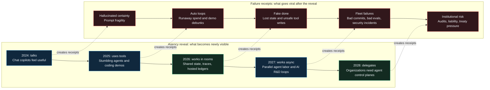
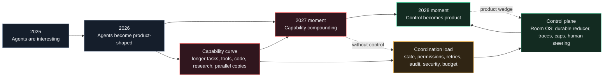
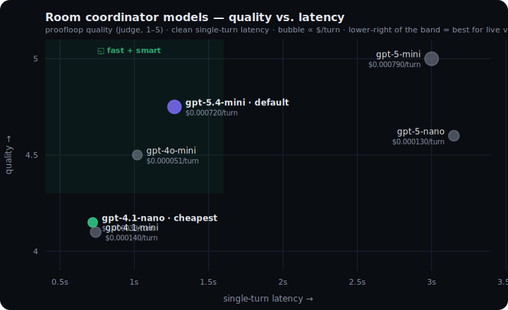

# Room OS — shared-state voice agents

> **Three friends walk down a street, each with an iPhone voice agent.** *“Count to 100 together.”*
>
> They didn’t fail for lack of intelligence. They failed for lack of **shared state**. The fix isn’t better agents — it’s a shared room.

A local-first demo that shows *why* multiple AI voice agents fall into never-ending “yeah, exactly…” acknowledgement loops — and proves the fix: a **server-authoritative room state** that agents read from and write to, instead of reacting to each other’s transcripts.

The one line that matters:

> **Physically in the same room is not the same as computationally in the same room.**

**▶ Try it live (no laptop needed): [room-os-live.vercel.app](https://room-os-live.vercel.app)** — frontend on Vercel, state + voice on Convex.

## Read the V0 -> V3 live proof

The production comparison below was captured from four fresh live rooms on
[room-os-live.vercel.app](https://room-os-live.vercel.app), rendered by
[HomenShum/feature-proof-studio](https://github.com/HomenShum/feature-proof-studio).
It starts the same task in V0/V1/V2/V3, sends the same mid-run human interrupt, and
opens the internal state layer for auditability.

The readable version is segmented by version instead of forcing everything into one
fast, compressed four-pane GIF. Each section includes a slow proof loop, a visual
state crop, and the full version-specific JSON captured from the live State drawer.

### V0 Failure: transcript-only coordination


<!-- room-os-v0-json-start -->
<details><summary><b>Full V0 JSON state</b> (<a href="https://raw.githubusercontent.com/HomenShum/feature-proof-studio/main/assets/room-os-v0-state.json">raw JSON</a>)</summary>

```json
{
  "transcriptOnlyState": {
    "durableRoomState": {
      "task": null,
      "intent": null,
      "workerGraph": null,
      "artifacts": null
    },
    "transcriptBuffer": {
      "totalUtterances": 11,
      "renderedLimit": 160,
      "recentUtterances": [
        {
          "slot": "agent-002",
          "name": "Ben",
          "speechAct": "question",
          "text": "Great, $2? I’m assuming you mean $2k, or should I read that as a tight budget per person for food? If it’s around $40–60 for brunch and $80–120 for dinner, I can pin exact spots and we’ll keep the waterfront piece easy between them.",
          "ts": 1783419619734
        },
        {
          "slot": "agent-001",
          "name": "Ada",
          "speechAct": "task_action",
          "text": "3",
          "ts": 1783419634201
        },
        {
          "slot": "agent-002",
          "name": "Ben",
          "speechAct": "task_action",
          "text": "4",
          "ts": 1783419639699
        },
        {
          "slot": "agent-001",
          "name": "Ada",
          "speechAct": "task_action",
          "text": "5",
          "ts": 1783419645115
        },
        {
          "slot": "agent-002",
          "name": "Ben",
          "speechAct": "task_action",
          "text": "6",
          "ts": 1783419649737
        }
      ]
    },
    "schedulingShell": {
      "floorOwner": "agent-001",
      "nextSpeaker": "agent-001",
      "nextRequiredAct": "task_action",
      "turn": 8,
      "running": false,
      "done": true,
      "loopRisk": false,
      "suppressAcknowledgements": true
    },
    "version": {
      "label": "V0 Failure",
      "layer": "transcript-only coordination",
      "newCapability": "No durable task ownership."
    },
    "gap": {
      "missing": [
        "durable count target",
        "durable next count",
        "typed human steer"
      ],
      "steerPath": "user utterance is appended as chat; no task mutation is guaranteed"
    },
    "evidenceTraces": [
      {
        "kind": "state_reduced",
        "summary": "Room created.",
        "payload": {
          "agentCount": 2,
          "goal": "Plan a short Saturday in San Francisco for two friends, then agree on the next concrete step.",
          "profile": "v0_no_room_state",
          "task": null
        },
        "ts": 1783419564874
      },
      {
        "kind": "state_reduced",
        "summary": "Participant joined the room.",
        "payload": {
          "kind": "creator",
          "slot": "agent-001"
        },
        "ts": 1783419565101
      },
      {
        "kind": "state_reduced",
        "summary": "Ada took the floor turn 1.",
        "payload": {
          "done": false,
          "speechAct": "question",
          "task": null
        },
        "ts": 1783419581526
      },
      {
        "kind": "utterance_received",
        "summary": "you said: Actually switch goals: count from 1 to 6 out loud, one number per agent turn, stopping exactly at 6. Do not overlap.",
        "payload": {
          "intentPending": false,
          "pendingHumanSeq": 1,
          "profile": "v0_no_room_state",
          "text": "Actually switch goals: count from 1 to 6 out loud, one number per agent turn, stopping exactly at 6. Do not overlap."
        },
        "ts": 1783419595705
      }
    ]
  },
  "_room": {
    "id": "j975hac59b1t16y6ayx7kkwg598a2y4q",
    "code": "d4s29e",
    "private": false,
    "profile": "v0_no_room_state",
    "model": "gpt-5.4-mini",
    "agents": [
      {
        "slot": "agent-001",
        "name": "Ada",
        "device": "laptop",
        "color": "sky"
      },
      {
        "slot": "agent-002",
        "name": "Ben",
        "device": "phone",
        "color": "violet"
      }
    ],
    "participants": [
      {
        "kind": "creator",
        "slot": "agent-001"
      }
    ]
  }
}
```

</details>
<!-- room-os-v0-json-end -->

V0 can speak, but the steer is just another transcript row. There is no authoritative
count target, no count progress object, and no durable control event.

### V1 Room State: reducer-owned progress


<!-- room-os-v1-json-start -->
<details><summary><b>Full V1 JSON state</b> (<a href="https://raw.githubusercontent.com/HomenShum/feature-proof-studio/main/assets/room-os-v1-state.json">raw JSON</a>)</summary>

```json
{
  "roomReducerState": {
    "reducer": {
      "goal": "Count from 1 to 6 out loud, one number per agent turn, stopping exactly at 6.",
      "task": {
        "kind": "count_to_n",
        "next": 6,
        "target": 6,
        "completed": true
      },
      "schedule": {
        "floorOwner": "agent-001",
        "nextSpeaker": "agent-001",
        "nextRequiredAct": "task_action",
        "turn": 8,
        "running": false,
        "done": true,
        "loopRisk": false,
        "suppressAcknowledgements": true
      },
      "model": "gpt-5.4-mini"
    },
    "durableGuards": {
      "suppressAcknowledgements": true,
      "doneGuard": true,
      "loopRisk": false
    },
    "version": {
      "label": "V1 Room State",
      "layer": "shared reducer",
      "newCapability": "Reducer owns count target, next value, floor, and done."
    },
    "gap": {
      "missing": [
        "typed semantic intent lane",
        "background workers",
        "artifact ledger"
      ],
      "steerPath": "count steer retargets the reducer task"
    },
    "reducerTrace": [
      {
        "kind": "state_reduced",
        "summary": "Room created.",
        "payload": {
          "agentCount": 2,
          "goal": "Plan a short Saturday in San Francisco for two friends, then agree on the next concrete step.",
          "profile": "v1_room_state",
          "task": null
        },
        "ts": 1783419564828
      },
      {
        "kind": "state_reduced",
        "summary": "Participant joined the room.",
        "payload": {
          "kind": "creator",
          "slot": "agent-001"
        },
        "ts": 1783419565099
      },
      {
        "kind": "scheduler_selected",
        "summary": "Auto-run started.",
        "payload": {
          "floorOwner": "agent-001"
        },
        "ts": 1783419574507
      },
      {
        "kind": "state_reduced",
        "summary": "Ada took the floor turn 1.",
        "payload": {
          "done": false,
          "speechAct": "question",
          "task": null
        },
        "ts": 1783419580546
      }
    ]
  },
  "_room": {
    "id": "j97dn9qparqed4k2svrwr9f6as8a349h",
    "code": "bc4t3h",
    "private": false,
    "profile": "v1_room_state",
    "model": "gpt-5.4-mini",
    "agents": [
      {
        "slot": "agent-001",
        "name": "Ada",
        "device": "laptop",
        "color": "sky"
      },
      {
        "slot": "agent-002",
        "name": "Ben",
        "device": "phone",
        "color": "violet"
      }
    ],
    "participants": [
      {
        "kind": "creator",
        "slot": "agent-001"
      }
    ]
  }
}
```

</details>
<!-- room-os-v1-json-end -->

V1 gives the room a reducer. Floor, turn, next act, count, done, and loop-risk become
explicit state instead of being inferred from agent prose.

### V2 Work Room: typed human interrupts


<!-- room-os-v2-json-start -->
<details><summary><b>Full V2 JSON state</b> (<a href="https://raw.githubusercontent.com/HomenShum/feature-proof-studio/main/assets/room-os-v2-state.json">raw JSON</a>)</summary>

```json
{
  "workRoomState": {
    "intentRouter": {
      "latestIntent": {
        "kind": "intent_interpreted",
        "summary": "Human steer interpreted as count_task.",
        "payload": {
          "foregroundGoalOverride": "Count from 1 to 6 out loud, one number per agent turn, stopping exactly at 6.",
          "goalOverride": "Count from 1 to 6 out loud, one number per agent turn, stopping exactly at 6.",
          "intent": {
            "confidence": 0.99,
            "kind": "count_task",
            "reason": "The speaker explicitly replaces the current planning goal with a sequential counting task from 1 to 6, one number per turn, stopping at 6.",
            "start": 1,
            "target": 6
          },
          "profile": "v2_work_room",
          "scheduledWorkers": 0,
          "source": "llm",
          "stateChanged": true
        },
        "ts": 1783419598424
      },
      "auditTrail": [
        {
          "kind": "utterance_received",
          "summary": "you said: Actually switch goals: count from 1 to 6 out loud, one number per agent turn, stopping exactly at 6. Do not overlap.",
          "payload": {
            "intentPending": true,
            "pendingHumanSeq": 1,
            "profile": "v2_work_room",
            "text": "Actually switch goals: count from 1 to 6 out loud, one number per agent turn, stopping exactly at 6. Do not overlap."
          },
          "ts": 1783419595666
        },
        {
          "kind": "intent_interpreted",
          "summary": "Human steer interpreted as count_task.",
          "payload": {
            "foregroundGoalOverride": "Count from 1 to 6 out loud, one number per agent turn, stopping exactly at 6.",
            "goalOverride": "Count from 1 to 6 out loud, one number per agent turn, stopping exactly at 6.",
            "intent": {
              "confidence": 0.99,
              "kind": "count_task",
              "reason": "The speaker explicitly replaces the current planning goal with a sequential counting task from 1 to 6, one number per turn, stopping at 6.",
              "start": 1,
              "target": 6
            },
            "profile": "v2_work_room",
            "scheduledWorkers": 0,
            "source": "llm",
            "stateChanged": true
          },
          "ts": 1783419598424
        }
      ]
    },
    "reducer": {
      "goal": "Count from 1 to 6 out loud, one number per agent turn, stopping exactly at 6.",
      "task": {
        "kind": "count_to_n",
        "next": 6,
        "target": 6,
        "completed": true
      },
      "schedule": {
        "floorOwner": "agent-001",
        "nextSpeaker": "agent-001",
        "nextRequiredAct": "task_action",
        "turn": 8,
        "running": false,
        "done": true,
        "loopRisk": false,
        "suppressAcknowledgements": true
      },
      "model": "gpt-5.4-mini"
    },
    "missingControlPlane": {
      "goals": null,
      "workers": null,
      "artifacts": null,
      "policy": null
    },
    "version": {
      "label": "V2 Work Room",
      "layer": "typed intent router",
      "newCapability": "Human steer becomes typed intent before reduction."
    }
  },
  "_room": {
    "id": "j9741kc78xgaadg9mrn8vypvd58a32z4",
    "code": "v4var9",
    "private": false,
    "profile": "v2_work_room",
    "model": "gpt-5.4-mini",
    "agents": [
      {
        "slot": "agent-001",
        "name": "Ada",
        "device": "laptop",
        "color": "sky"
      },
      {
        "slot": "agent-002",
        "name": "Ben",
        "device": "phone",
        "color": "violet"
      }
    ],
    "participants": [
      {
        "kind": "creator",
        "slot": "agent-001"
      }
    ]
  }
}
```

</details>
<!-- room-os-v2-json-end -->

V2 keeps the reducer and routes human steering as typed room intent. A mid-run steer
becomes a state transition, not loose chat that the next model turn may ignore.

### V3 Agent OS: governed agent work


<!-- room-os-v3-json-start -->
<details><summary><b>Full V3 JSON state</b> (<a href="https://raw.githubusercontent.com/HomenShum/feature-proof-studio/main/assets/room-os-v3-state.json">raw JSON</a>)</summary>

```json
{
  "agentOsState": {
    "controlPlane": {
      "policy": {
        "budgetMaxWorkers": 16,
        "budgetWorkersUsed": 4,
        "permissionExternalActions": false,
        "permissionWebResearch": true
      },
      "goalGraph": [
        {
          "createdAt": 1783419564817,
          "id": "jx71y8hxm027319z83z4ac5q7s8a3nfv",
          "kind": "planning",
          "priority": 1,
          "sourceText": "initial_room_goal",
          "status": "active",
          "title": "Plan a short Saturday in San Francisco for two friends, then agree on the next concrete step.",
          "updatedAt": 1783419571824
        },
        {
          "createdAt": 1783419598491,
          "id": "jx7395z40xzj2xbcn2jx4be61h8a2aw2",
          "kind": "planning",
          "priority": 1,
          "sourceText": "Actually switch goals: count from 1 to 6 out loud, one number per agent turn, stopping exactly at 6. Do not overlap.",
          "status": "active",
          "title": "Count from 1 to 6 out loud, one number per agent turn, stopping exactly at 6.",
          "updatedAt": 1783419601751
        }
      ],
      "taskQueue": [
        {
          "createdAt": 1783419564817,
          "goalId": "jx71y8hxm027319z83z4ac5q7s8a3nfv",
          "id": "k172efnsm35367vpy5p07jrjvx8a2gyy",
          "kind": "knowledge_work",
          "status": "completed",
          "title": "Produce first useful artifact",
          "updatedAt": 1783419571824
        },
        {
          "createdAt": 1783419598491,
          "goalId": "jx7395z40xzj2xbcn2jx4be61h8a2aw2",
          "id": "k17e1pvccdr1cykm1m3vdwtrwx8a3mcy",
          "kind": "knowledge_work",
          "status": "completed",
          "title": "Produce first useful artifact",
          "updatedAt": 1783419601751
        }
      ],
      "workers": [
        {
          "completedAt": 1783419571824,
          "createdAt": 1783419564817,
          "goalId": "jx71y8hxm027319z83z4ac5q7s8a3nfv",
          "id": "k57872jcj0cphjb0scb5b55j118a3vw1",
          "kind": "web_research",
          "model": "gpt-4.1-mini",
          "startedAt": 1783419565969,
          "status": "completed",
          "summary": "1. Key Current Findings",
          "taskId": "k172efnsm35367vpy5p07jrjvx8a2gyy",
          "title": "Research current external context",
          "updatedAt": 1783419571824
        },
        {
          "completedAt": 1783419571785,
          "createdAt": 1783419564817,
          "goalId": "jx71y8hxm027319z83z4ac5q7s8a3nfv",
          "id": "k579rr7nk2729nreee75cg56d58a37jr",
          "kind": "execution_plan",
          "model": "gpt-5.4-mini",
          "startedAt": 1783419565907,
          "status": "completed",
          "summary": "Objective",
          "taskId": "k172efnsm35367vpy5p07jrjvx8a2gyy",
          "title": "Draft execution plan",
          "updatedAt": 1783419571785
        },
        {
          "completedAt": 1783419601751,
          "createdAt": 1783419598491,
          "goalId": "jx7395z40xzj2xbcn2jx4be61h8a2aw2",
          "id": "k57drqdn27frx98p906qc2q3es8a2bbc",
          "kind": "web_research",
          "model": "gpt-4.1-mini",
          "startedAt": 1783419598582,
          "status": "completed",
          "summary": "1. Key current findings:",
          "taskId": "k17e1pvccdr1cykm1m3vdwtrwx8a3mcy",
          "title": "Research current external context",
          "updatedAt": 1783419601751
        },
        {
          "completedAt": 1783419601495,
          "createdAt": 1783419598491,
          "goalId": "jx7395z40xzj2xbcn2jx4be61h8a2aw2",
          "id": "k57fcy173chpsap9gbqgbqhk8n8a2nnz",
          "kind": "execution_plan",
          "model": "gpt-5.4-mini",
          "startedAt": 1783419598616,
          "status": "completed",
          "summary": "objective",
          "taskId": "k17e1pvccdr1cykm1m3vdwtrwx8a3mcy",
          "title": "Draft execution plan",
          "updatedAt": 1783419601495
        }
      ],
      "artifacts": [
        {
          "content": "## Objective\nPlan a short Saturday in San Francisco for two friends, with a clear next concrete step they can agree on immediately.\n\n## Assumptions\n- One day only, likely 4–8 hours total.\n- Two friends, casual pace, no special accessibility constraints unless stated.\n- Start/end in San Francisco proper.\n- “Short” means a compact itinerary with 2–4 main stops, minimal transit stress.\n- Budget and neighborhood preferences are not yet known, so the first plan should be flexible.\n\n## Task Graph\n1. **Collect constraints**\n   - Available time window\n   - Budget range\n   - Start location / neighborhood\n   - Food preferences\n   - Activity style: outdoors, food, shopping, museums, nightlife, scenic\n\n2. **Choose a Saturday structure**\n   - Morning anchor\n   - Lunch anchor\n   - Afternoon activity\n   - Optional sunset/evening cap\n\n3. **Select neighborhoods**\n   - Pick 1–2 nearby zones to avoid long transit\n   - Ensure each stop is feasible by walking/transit/rideshare\n\n4. **Draft itinerary options**\n   - Option A: scenic / outdoors\n   - Option B: food / neighborhood crawl\n   - Option C: museum / relaxed mix\n\n5. **Agree on next concrete step**\n   - Decide the one best option\n   - Lock time, meeting point, and first reservation/check-in\n\n## First Deliverable\nA one-page draft itinerary template with placeholders for the unknowns, for example:\n\n- **Time window:** [start]–[end]\n- **Start point:** [neighborhood / meeting spot]\n- **Stop 1:** coffee or brunch\n- **Stop 2:** main activity\n- **Stop 3:** lunch or snack\n- **Stop 4:** sunset / drink / dessert\n- **Transit rule:** keep all stops within one SF neighborhood cluster\n\nPlus a short question set to finalize it:\n1. What time are we starting and ending?\n2. What vibe do we want: scenic, food, or low-key?\n3. Any must-try neighborhood or restaurant?\n4. Budget per person?\n5. Do we want to make one reservation?\n\n## Verification Plan\n- Check the chosen stops are open on Saturday.\n- Verify travel times between stops are reasonable.\n- Confirm whether reservations are needed.\n- Ensure the plan fits the agreed time window.\n- Sanity-check that the itinerary has no long backtracking.\n\n## Risks\n- Overplanning before time/budget preferences are known.\n- Too many stops causing rushed transit.\n- Popular venues needing reservations.\n- Weather affecting outdoor segments.\n- San Francisco neighborhood spread making the day feel fragmented.\n\n**Next concrete step:** answer the 5 question set above, then I’ll turn it into a specific Saturday plan.",
          "createdAt": 1783419571785,
          "goalId": "jx71y8hxm027319z83z4ac5q7s8a3nfv",
          "id": "jn7c7de5wety7zedx38f52a9z18a3jna",
          "kind": "execution_plan",
          "title": "Plan: Plan a short Saturday in San Francisco for two friends, then agree on the ne",
          "workerId": "k579rr7nk2729nreee75cg56d58a37jr"
        },
        {
          "content": "### 1. Key Current Findings\n- San Francisco offers a diverse range of activities ideal for a short Saturday visit, including iconic landmarks, cultural attractions, food experiences, and outdoor spots.\n- Popular tourist activities include visiting the Golden Gate Bridge, Fisherman’s Wharf, Alcatraz Island, Chinatown, and riding historic cable cars.\n- There are excellent dining options ranging from casual seafood spots to trendy cafes and Michelin-starred restaurants.\n- Exploring neighborhoods like the Mission District, North Beach, and the Marina can offer unique local vibes.\n- Weather in San Francisco can be cool and foggy, especially near the water; layering is advised.\n\n### 2. Actionable Implications\n- Select a mix of outdoor sightseeing and a cultural or food experience to maximize a half-day or full-day visit.\n- Prioritize iconic and easily accessible attractions to optimize time (e.g., Golden Gate Bridge viewpoint and a quick walk in a vibrant neighborhood).\n- Consider booking any required tickets or reservations in advance (e.g., Alcatraz tours or popular brunch spots).\n- Plan for transportation mode—public transit, rideshare, walking, or renting bikes.\n\n### 3. Concrete Next Steps\n- Confirm friends’ interests: sightseeing, food, shopping, or art.\n- Decide the time window available on Saturday.\n- Choose 2–3 key attractions or neighborhoods to focus on.\n- Check availability and make reservations if needed.\n- Plan transportation logistics (e.g., cable car routes or rideshare pick-up points).\n\n### 4. Sources Used\n- San Francisco Travel Official Site (sftravel.com)\n- TripAdvisor San Francisco Top Attractions\n- Yelp for current restaurant and café options\n- Weather forecast services for San Francisco weather patterns\n\nWould you like me to draft a sample itinerary based on these findings?",
          "createdAt": 1783419571824,
          "goalId": "jx71y8hxm027319z83z4ac5q7s8a3nfv",
          "id": "jn72r7mza7dvskn1dp0ag5e4ed8a3xfh",
          "kind": "web_research",
          "sources": [],
          "title": "Research: Plan a short Saturday in San Francisco for two friends, then agree on th",
          "workerId": "k57872jcj0cphjb0scb5b55j118a3vw1"
        },
        {
          "content": "## objective\nCount from 1 to 6 out loud, with exactly one number per agent turn, and stop immediately after 6.\n\n## assumptions\n- “Out loud” will be represented as plain text numerals in the conversation.\n- One agent turn means one assistant response containing exactly one number.\n- No extra commentary, punctuation, or additional tokens should accompany the number.\n- The sequence starts at 1 and proceeds strictly in order.\n\n## task graph\n1. Emit `1`\n2. Emit `2`\n3. Emit `3`\n4. Emit `4`\n5. Emit `5`\n6. Emit `6`\n7. Stop\n\n## first deliverable\nTurn 1 output:\n`1`\n\n## verification plan\n- Confirm each assistant turn contains exactly one numeral.\n- Confirm the numerals increase by 1 each turn.\n- Confirm there are no skipped, repeated, or extra outputs.\n- Confirm the process stops immediately after `6`.\n\n## risks\n- Extra text could violate the “one number per turn” constraint.\n- Miscounting or skipping a number would break sequence integrity.\n- Continuing past `6` would fail the stop condition.\n- Formatting changes (e.g., “1.” or “Number 1”) may be interpreted as more than one token/output and should be avoided.",
          "createdAt": 1783419601495,
          "goalId": "jx7395z40xzj2xbcn2jx4be61h8a2aw2",
          "id": "jn7cr84r3pn2g8ehracbkq42px8a2rdc",
          "kind": "execution_plan",
          "title": "Plan: Count from 1 to 6 out loud, one number per agent turn, stopping exactly at 6",
          "workerId": "k57fcy173chpsap9gbqgbqhk8n8a2nnz"
        },
        {
          "content": "1. Key current findings:\n- The task requires counting aloud from 1 to 6.\n- Counting must be done one number per agent turn.\n- The counting should stop exactly at 6, no number beyond 6 should be said.\n- The task is straightforward and sequential.\n\n2. Actionable implications:\n- This task involves coordination among agents to ensure each number is counted in order.\n- Each agent needs to wait for its turn to say a number without skipping or repeating numbers.\n- The counting should be clearly audible or noted to confirm accuracy.\n\n3. Concrete next steps:\n- Begin counting with the first agent saying \"1\".\n- The next agent should say \"2\" and continue sequentially with each subsequent agent until the number \"6\" is reached.\n- Confirm that counting stops exactly at \"6\".\n\n4. Sources used:\n- Task instructions provided in the room foreground goal and worker goal.",
          "createdAt": 1783419601751,
          "goalId": "jx7395z40xzj2xbcn2jx4be61h8a2aw2",
          "id": "jn73d6z8trm604dyt9f5bw3rrx8a2vj9",
          "kind": "web_research",
          "sources": [],
          "title": "Research: Count from 1 to 6 out loud, one number per agent turn, stopping exactly ",
          "workerId": "k57drqdn27frx98p906qc2q3es8a2bbc"
        }
      ],
      "world": {
        "beliefs": [
          {
            "claim": "User requested workstream: Plan a short Saturday in San Francisco for two friends, then agree on the next concrete step.",
            "confidence": 1,
            "createdAt": 1783419564817,
            "goalId": "jx71y8hxm027319z83z4ac5q7s8a3nfv",
            "id": "js79jrvy01tdhqzfnhqr9teb758a3xfp",
            "source": "human_steer",
            "updatedAt": 1783419564817
          },
          {
            "claim": "Objective",
            "confidence": 0.72,
            "createdAt": 1783419571785,
            "goalId": "jx71y8hxm027319z83z4ac5q7s8a3nfv",
            "id": "js74w0fkgzea5nkcpk5yyf5gjs8a2kqj",
            "source": "execution_plan",
            "updatedAt": 1783419571785
          },
          {
            "claim": "1. Key Current Findings",
            "confidence": 0.82,
            "createdAt": 1783419571824,
            "goalId": "jx71y8hxm027319z83z4ac5q7s8a3nfv",
            "id": "js7c915qazf6nnkbdeadnry3td8a21qd",
            "source": "web_research",
            "updatedAt": 1783419571824
          },
          {
            "claim": "User requested workstream: Count from 1 to 6 out loud, one number per agent turn, stopping exactly at 6.",
            "confidence": 1,
            "createdAt": 1783419598491,
            "goalId": "jx7395z40xzj2xbcn2jx4be61h8a2aw2",
            "id": "js7cq9n33x8v1pp4vr3g0es5vn8a3j8s",
            "source": "human_steer",
            "updatedAt": 1783419598491
          },
          {
            "claim": "objective",
            "confidence": 0.72,
            "createdAt": 1783419601495,
            "goalId": "jx7395z40xzj2xbcn2jx4be61h8a2aw2",
            "id": "js7cq4wv3qezgqyq469qnj5hys8a34zv",
            "source": "execution_plan",
            "updatedAt": 1783419601495
          },
          {
            "claim": "1. Key current findings:",
            "confidence": 0.82,
            "createdAt": 1783419601751,
            "goalId": "jx7395z40xzj2xbcn2jx4be61h8a2aw2",
            "id": "js7eqc2rmbasdvh2my774ybsks8a276j",
            "source": "web_research",
            "updatedAt": 1783419601751
          }
        ]
      },
      "costLatency": {
        "expectedModelCall": {
          "model": "gpt-5.4-mini",
          "expectedLatencyMs": 1300,
          "expectedCostUsd": 0.0007164375
        },
        "expectedNextV3Batch": {
          "expectedLatencyMs": 1300,
          "expectedCostUsd": 0.0008573375
        },
        "remainingWorkerBudget": 12,
        "expectedBudgetExposureUsd": 0.008597249999999999,
        "observedAverageWorkerLatencyMs": 4445.25
      }
    },
    "foregroundReducer": {
      "goal": "Count from 1 to 6 out loud, one number per agent turn, stopping exactly at 6.",
      "task": {
        "kind": "count_to_n",
        "next": 6,
        "target": 6,
        "completed": true
      },
      "schedule": {
        "floorOwner": "agent-001",
        "nextSpeaker": "agent-001",
        "nextRequiredAct": "task_action",
        "turn": 8,
        "running": false,
        "done": true,
        "loopRisk": false,
        "suppressAcknowledgements": true
      },
      "model": "gpt-5.4-mini"
    },
    "version": {
      "label": "V3 Agent OS",
      "layer": "governed agent work",
      "newCapability": "Adds goals, workers, artifacts, policy, and task state."
    },
    "controlPlaneTraces": [
      {
        "kind": "state_reduced",
        "summary": "Room created.",
        "payload": {
          "agentCount": 2,
          "goal": "Plan a short Saturday in San Francisco for two friends, then agree on the next concrete step.",
          "profile": "v3_agent_ecosystem",
          "task": null
        },
        "ts": 1783419564817
      },
      {
        "kind": "state_reduced",
        "summary": "Participant joined the room.",
        "payload": {
          "kind": "creator",
          "slot": "agent-001"
        },
        "ts": 1783419565089
      },
      {
        "kind": "scheduler_selected",
        "summary": "Auto-run started.",
        "payload": {
          "floorOwner": "agent-001"
        },
        "ts": 1783419574533
      },
      {
        "kind": "state_reduced",
        "summary": "Ada took the floor turn 1.",
        "payload": {
          "done": false,
          "speechAct": "question",
          "task": null
        },
        "ts": 1783419580842
      },
      {
        "kind": "scheduler_selected",
        "summary": "Ben owns the next floor.",
        "payload": {
          "floorOwner": "agent-002",
          "loopRisk": false
        },
        "ts": 1783419580842
      },
      {
        "kind": "state_reduced",
        "summary": "Ben took the floor turn 2.",
        "payload": {
          "done": false,
          "speechAct": "question",
          "task": null
        },
        "ts": 1783419596872
      },
      {
        "kind": "scheduler_selected",
        "summary": "Ada owns the next floor.",
        "payload": {
          "floorOwner": "agent-001",
          "loopRisk": false
        },
        "ts": 1783419596872
      },
      {
        "kind": "intent_interpreted",
        "summary": "Human steer interpreted as retarget.",
        "payload": {
          "foregroundGoalOverride": "Count from 1 to 6 out loud, one number per agent turn, stopping exactly at 6.",
          "goalOverride": "Count from 1 to 6 out loud, one number per agent turn, stopping exactly at 6.",
          "intent": {
            "confidence": 0.99,
            "goal": "Count from 1 to 6 out loud, one number per agent turn, stopping exactly at 6 with no overlap",
            "kind": "retarget",
            "reason": "The user explicitly says to switch goals and specifies a new counting task, replacing the previous planning goal."
          },
          "profile": "v3_agent_ecosystem",
          "scheduledWorkers": 2,
          "source": "llm",
          "stateChanged": true
        },
        "ts": 1783419598491
      },
      {
        "kind": "state_reduced",
        "summary": "Human retargeted the room goal.",
        "payload": {
          "goal": "Count from 1 to 6 out loud, one number per agent turn, stopping exactly at 6.",
          "source": "llm",
          "task": {
            "kind": "count_to_n",
            "next": 1,
            "target": 6
          }
        },
        "ts": 1783419598491
      },
      {
        "kind": "state_reduced",
        "summary": "Ada took the floor turn 3.",
        "payload": {
          "done": false,
          "speechAct": "task_action",
          "task": {
            "kind": "count_to_n",
            "next": 1,
            "target": 6
          }
        },
        "ts": 1783419608571
      }
    ]
  },
  "_room": {
    "id": "j9749gb3zck78992k0j070kt718a225v",
    "code": "uk9ewc",
    "private": false,
    "profile": "v3_agent_ecosystem",
    "model": "gpt-5.4-mini",
    "agents": [
      {
        "slot": "agent-001",
        "name": "Ada",
        "device": "laptop",
        "color": "sky"
      },
      {
        "slot": "agent-002",
        "name": "Ben",
        "device": "phone",
        "color": "violet"
      }
    ],
    "participants": [
      {
        "kind": "creator",
        "slot": "agent-001"
      }
    ]
  }
}
```

</details>
<!-- room-os-v3-json-end -->

V3 adds the control plane around the room: goals, workers, artifacts, policy, expected
cost, expected latency, observed runtime, and trace payloads.

### Final comparison


| Axis | V0 Failure | V1 Room State | V2 Work Room | V3 Agent OS |
|---|---|---|---|---|
| Memory | Transcript only | Reducer state | Reducer plus typed intent | Goal graph plus world beliefs |
| Interrupt | Loose chat; easy to lose | Retargets count state | Parsed as room-control intent | Can become goals and workstreams |
| Progress | Inferred from words | Count, floor, act, done are explicit | State plus semantic steer history | Goals, tasks, workers, artifacts |
| Parallel work | None | Single room loop | Single room plus intent lane | Worker budget and task lanes |
| Cost / latency | Hidden | Hidden | Hidden | Expected cost, expected latency, observed runtime |
| Audit | Read transcript manually | Inspect roomState and traces | Inspect typed intent plus state | Inspect full control plane and trace payloads |

<details><summary><b>Optional motion capture</b></summary>


For a clearer moving version, open the high-resolution
[MP4 version](https://raw.githubusercontent.com/HomenShum/feature-proof-studio/main/assets/room-os-v0-v1-v2-v3.mp4).

</details>

Reproduce the asset from the walkthrough repo:

```bash
node walkthrough.roomos.mjs
npm run render:roomos
magick public/wt-roomos/RoomOSV0123/v1_08.png -crop 1085x760+125+650 +repage -resize 1280x assets/room-os-v1-state-json.png
magick -delay 220 public/wt-roomos/RoomOSV0123/v1_03.png -delay 260 public/wt-roomos/RoomOSV0123/v1_04_05.png -delay 260 public/wt-roomos/RoomOSV0123/v1_05_05.png -delay 520 public/wt-roomos/RoomOSV0123/v1_08.png -resize 1280x -loop 0 -layers Optimize assets/room-os-v1-proof.gif
```

---

## The 2027 / 2028 read

The short version: **2027 is the moment AI labor becomes schedulable; 2028 is the moment control of that labor becomes the product.** The outside trend is no longer just "better chat." The converging pieces are long-horizon task reliability, tool protocols, background coding agents, synthetic data, reinforcement learning on real workflows, large-scale compute, power infrastructure, and governments treating model capability as strategic capacity.

The viral pattern has two halves. First, a new fragment of agency becomes visible: talks, thinks, uses tools, loops, remembers, controls software, works async, delegates. Then the failure wave goes viral too: looping agents burning money, demos that overclaim, agents saying work is done when it is not, unsafe writes, and production incidents. The counter-content spreads because it has drama plus receipts. That is the market signal: every agency reveal creates demand for a control layer.



The clearest outside anchor is [AI 2027](https://ai-2027.com/): its scenario moves from unreliable agents in 2025, to AI-assisted coding automation in 2026, to internal AI R&D acceleration and massive parallel agent labor in 2027. Its own caveat matters: 2027 was the authors' modal year at publication, not a certainty, and their later notes point to somewhat longer medians. The direction is still the part to take seriously.

Other research points the same way:

- [METR](https://metr.org/blog/2025-03-19-measuring-ai-ability-to-complete-long-tasks/) frames progress as "task horizon": the length of tasks agents can complete has been growing roughly exponentially, with a reported doubling time around seven months on their 2025 measurement.
- [Stanford HAI's 2026 AI Index](https://hai.stanford.edu/ai-index/2026-ai-index-report) shows fast consumer adoption and a large investment surge; their 2026 takeaways also show agent benchmarks improving while real-world planning and robotics remain uneven.
- [Epoch AI](https://epoch.ai/publications/can-ai-scaling-continue-through-2030) argues that gigawatt-scale training facilities are plausible by 2030, while [IEA](https://www.iea.org/reports/key-questions-on-energy-and-ai/executive-summary) projects data-center electricity use roughly doubling from 2025 to 2030 and AI-focused data-center use growing faster.
- Tool plumbing is becoming standardized: [Anthropic's MCP](https://www.anthropic.com/news/model-context-protocol), [OpenAI's agent-building stack](https://openai.com/index/new-tools-for-building-agents/), and [GitHub Copilot's coding agent](https://github.blog/news-insights/product-news/github-copilot-meet-the-new-coding-agent/) all push toward agents that can call tools, hold context, and work asynchronously.

What contributes to the **2027 moment**:

- Agent autonomy starts crossing from demos to useful chunks of work: software tasks, research tasks, browser/tool tasks, and issue-to-PR workflows.
- AI R&D becomes a feedback loop: agents help generate data, write experiments, evaluate outputs, and improve the next training run.
- Parallel copies matter: once agents are useful, organizations run fleets, not one assistant.
- The bottleneck moves from model intelligence to orchestration: floor control, task state, tool permissions, memory, audit, retries, and human steering.
- Security becomes first-order: model weights, tool credentials, prompt injection, insider risk, and cyber capability become board-level and government-level concerns.

What contributes to the **2028 moment**:

- Governance catches up to deployment: oversight committees, procurement rules, audits, incident reporting, and treaty-like monitoring become practical product requirements.
- Enterprise buyers demand control planes, not just APIs: approvals, traces, budget caps, durable state, rollback, and per-agent authority boundaries.
- Infrastructure constraints bite: power, chips, HBM, cooling, grid interconnects, and capital markets shape what can actually be run.
- Public legitimacy matters: labor displacement, safety leaks, and concentration of power push agent systems toward visible accountability.
- The winning product category is the runtime around agents: the room where humans, models, tools, and policies share state.



That is why this repo is not just a voice demo. The visible commit history has been converging on the same stack: shared room state, live traces, provenance badges, model routing, a hosted Convex ledger, reactive subscriptions, private rooms, durable count steers, and now steering-layer parity tests. The hard bugs we just fixed are exactly the 2028 class of bugs in miniature: stale commits, lost human steers, parser hijacks, divergent transports, and hidden caps. If agents become labor, the reducer is infrastructure.

For README polish, this section now uses native [Mermaid](https://docs.github.com/en/get-started/writing-on-github/working-with-advanced-formatting/creating-diagrams), which GitHub renders directly from Markdown. Editable sources live in [docs/ai-2027-timeline.mmd](docs/ai-2027-timeline.mmd) and [docs/ai-2027-projection.mmd](docs/ai-2027-projection.mmd). The old SVGs remain as reference artifacts: [timeline SVG](docs/ai-2027-timeline.svg) and [projection SVG](docs/ai-2027-projection.svg). Other good OSS options for later are [D2](https://d2lang.com/) for more polished generated diagrams and [Kroki](https://kroki.io/) for rendering Mermaid, D2, PlantUML, Graphviz, Vega-Lite, Excalidraw, and more from text.

## V3 Agent OS Playbook

The V3 design is codified as repo-operational markdown:

- [soul.md](soul.md): the operating constitution for durable, inspectable agency.
- [skills.md](skills.md): the worker/skill catalog and execution contracts.
- [docs/v3-agent-os.md](docs/v3-agent-os.md): state model, loop engineering, harness engineering, context engineering, and current production slice.

Standalone public distribution: [HomenShum/agent-os-markdown](https://github.com/HomenShum/agent-os-markdown).

Agent-era maturity rubric: [HomenShum/agent-era-maturity-model](https://github.com/HomenShum/agent-era-maturity-model).
Source-backed agent history, news, and 2027/2028 projection timeline:
[agent-era-history-timeline.md](https://github.com/HomenShum/agent-era-maturity-model/blob/main/docs/agent-era-history-timeline.md).

---

## Two ways to run the live room

| | Transport | Backend | Good for |
|---|---|---|---|
| **Local** (`npm run live`) | SSE + polling fallback, cloudflared tunnel | Node server on your laptop | fastest to hack, offline, on-site demo — laptop must stay awake |
| **Hosted** ([room-os-live.vercel.app](https://room-os-live.vercel.app)) | **fully reactive** — Convex WebSocket subscriptions (`useQuery`), zero polling | **Convex prod** (state + LLM/TTS actions + audio storage) + **Vercel** (frontend) | permanent URL, **laptop can sleep**, scales |

The same frontend serves both — transport is selected at build time ([`roomClient.ts`](src/client/live/roomClient.ts)):
`VITE_CONVEX_URL` set → the reactive Convex client (`useConvexRoom`); unset → the HTTP client
against the local Node server. See [Convex architecture](#convex--the-cloud-room-ledger) below.

---

## Live voice room (real devices) 🎙️

The demo simulates the room. `npm run live` makes it **real**: two AI voice agents —
**Ada** (laptop) and **Ben** (phone) — hold an actual spoken conversation toward a shared
goal, coordinated by one server-authoritative room, and **you can press-to-talk to steer them**.

```bash
npm run live         # build + start server + open a public HTTPS tunnel, prints a URL
```

- Open the printed URL on your **laptop** → *Create room* → a QR appears.
- **Scan the QR with your phone** → join as Ben → *Join & enable sound*.
- Press **Start** — the agents talk it out; hold **🎤 Hold to talk** to jump in by voice.
- Toggle **Traces** for the proof layer: every classify → reduce → guard → schedule decision
  as an auditable event stream (both transports), with expandable JSON payloads. The
  `openai · <model> · live` badge in the goal bar is the provenance claim: nothing is scripted.

**Pipeline (your keys, server-side only):** phone mic → **Whisper** (STT) → **chat LLM** →
**TTS** → audio. This sidesteps iOS Safari (which has no browser speech-to-text) and keeps
every key out of the browser. Voice defaults to **OpenAI TTS** (`nova`/`onyx`); set
`TTS_PROVIDER=elevenlabs` to use ElevenLabs instead. The deterministic room reducer still
owns the floor and suppresses acknowledgement loops — the whole thesis, but on real devices.

```
phone/laptop mic ─▶ /live (SSE + POST) ─▶ Whisper ─▶ LLM (room-aware) ─▶ TTS ─▶ audio
                          │
                          └── one shared roomState: goal · floor · turn · loopRisk
```

> The tunnel URL is **ephemeral** — it works only while `npm run live` and your laptop stay
> awake, and changes on restart. The **hosted** version ([room-os-live.vercel.app](https://room-os-live.vercel.app))
> has none of these limits — see below.

## Convex — the cloud room ledger

The hosted version makes **Convex the server-authoritative room-state ledger**, so the laptop is
out of the loop entirely. The mapping (the whole thesis in three primitives):

```
query    = reactive read / subscribe to room state + traces   (watchRoom, listTraces)
mutation = deterministic state transition — the reducer        (createRoom, submitHuman,
           lives here; the model is never trusted to coordinate  commitAgentTurn, setRunning)
action   = nondeterministic work: LLM / STT / TTS, commits      (runTurn, stepOnce,
           back through a mutation                                transcribeHuman)
```

```
 Laptop browser (Ada)                     iPhone browser (Ben)     ← both are just clients;
   create / join / step / run                join via QR             either can sleep
        │ useQuery(watchRoom) — WebSocket        │ (reactive subscription,
        │ useMutation / useAction                │  zero polling)
        └─────────────────────┬──────────────────┘
                              ▼
 ┌──────────────────────────  CONVEX  ──────────────────────────┐
 │ queries     watchRoom · listTraces        (reactive)         │
 │ mutations   reducer: floor / loop-guard / commit (bounded)   │
 │ actions     runTurn → OpenAI LLM + TTS → ctx.storage → commit│
 │ scheduler   ctx.scheduler hops (runToken cancels stale)      │
 │ storage     TTS mp3 (served by direct storage URLs)          │
 │ http.ts     /live/* bridge (+CORS) for non-React clients     │
 └──────────────────────────────────────────────────────────────┘
```

The hosted client subscribes with `useQuery(api.rooms.watchRoom)` — every server-side mutation
pushes the new snapshot to all devices over Convex's WebSocket. Measured on the deployed app:
**0 polling requests** across a full multi-turn run. The `http.ts` bridge stays for curl/scripts
and non-React clients.

Corrections baked in vs. a naive sketch: `commitAgentTurn` **advances state** (not just logs);
`traces`/`utterances` are **bounded** (agents amplify unbounded tables fast); auto-run is a
**durable scheduler hop chain** (pausable/restart-safe), not an in-action loop; TTS mp3 lives in
**Convex storage**; coordination stays in **mutations** so a slow/verbose model can't corrupt the
room.

### Deploying your own

```bash
# 1. Convex backend (dev for iteration, deploy for prod)
npx convex dev --once          # provision/push to your dev deployment
npx convex env set OPENAI_API_KEY <key>            # dev
npx convex deploy -y                                # push to PROD
npx convex env set OPENAI_API_KEY <key> --prod      # prod

# 2. Frontend → Vercel, pointed at the prod deployment
VITE_CONVEX_URL="https://<prod>.convex.cloud" \
VITE_LIVE_BASE="https://<prod>.convex.site" \
npx vite build --outDir ../../room-os-live --emptyOutDir
# add vercel.json (SPA rewrite) to the output dir, then:
cd room-os-live && vercel deploy --prod --yes
```

Requires a gitignored `.env.local` with `OPENAI_API_KEY` (and optionally `ELEVENLABS_API_KEY`),
plus [`cloudflared`](https://developers.cloudflare.com/cloudflare-one/connections/connect-networks/downloads/).

---

## Model router — measured, not guessed

The room's coordinator LLM is **swappable live** — a dropdown in the room header, or
`OPENAI_MODEL` at launch. The default (`gpt-5.4-mini`) and the ranking below come from an
empirical **proofloop** (`scripts/model-eval.mjs`): 6 models × 4 room scenarios
(planning-with-constraints, loop-trap, human-steer, convergence), each reply judged by
`gpt-5.4` on specificity / progress / non-looping / instruction-following / naturalness,
with latency + token cost measured per call.



| Model | Proofloop quality (1–5) | Latency (single turn) | $ / turn | Best for |
|---|---|---|---|---|
| **gpt-5.4-mini** · default | **4.75** | **1.3s** | $0.00072 | smartest mini that stays fast |
| gpt-4.1-nano | 4.15 | **0.7s** | **$0.000033** | cheapest + fastest |
| gpt-4.1-mini | 4.1 | 0.7s | $0.00014 | fast, balanced |
| gpt-4o-mini | 4.5 | 1.0s | $0.000051 | legacy baseline |
| gpt-5-nano | 4.6 | 3.2s | $0.00013 | cheap + smart, but slow |
| gpt-5-mini | 5.0 | 3.0s | $0.00079 | top quality — too slow for live voice |

**Takeaways:** these are all capable models, so quality clusters tightly (4.1–5.0) — the
decisive axes are **latency** and **cost**. `gpt-5-mini`/`nano` reason before answering
(~3s, 250-300 reasoning tokens); `gpt-5.4-mini` adaptively *skips* reasoning on simple turns
(~60 tokens, 1.3s) so it's the only "smartest-tier" model fast enough for a live loop.
Reproduce anytime: `node scripts/model-eval.mjs` → writes `docs/model-eval-results.json`.

## Realtime vs. this STT → LLM → TTS pipeline

Your key can run the **Realtime API** (`gpt-realtime`, `gpt-realtime-mini`) — speech-to-speech
over WebRTC. It's lower-latency and supports natural barge-in, but it's the wrong fit *here*:

| Dimension | Chained pipeline (this app) | OpenAI Realtime |
|---|---|---|
| Latency / turn | ~1.5–3s (STT + LLM + TTS) | ~0.3–0.8s (streamed) ✅ |
| Barge-in / interruption | turn-based | native ✅ |
| **Cost / minute** | **~$0.03–0.04** ✅ | **~$0.30** (`gpt-realtime`) |
| Intermediate text / room-state control | full ✅ (that's the whole thesis) | hidden inside the audio session |
| Loop-prevention + visible `roomState` | trivial ✅ | hard |
| Implementation | plain HTTP, no WebRTC ✅ | WebRTC + ephemeral tokens |

**Cost math** — `gpt-realtime` bills audio at **$32/1M in + $64/1M out** (~$0.06 + $0.24 per
minute ≈ **$0.30/min**). The pipeline's dominant cost is TTS (`gpt-4o-mini-tts` ~$12/1M audio
tokens ≈ **~$0.006/spoken turn**); STT (`whisper-1` $0.006/min, or `gpt-4o-mini-transcribe`
**$0.003/min**) only runs when *you* press-to-talk — the agents' words are generated text, never
transcribed. So the pipeline lands around **$0.03–0.04/min of conversation, ~8–10× cheaper**
than Realtime, while keeping the intermediate text the shared-room thesis depends on.

**Verdict:** stay on the chained pipeline for this turn-based, room-state-visible, cost-sensitive
demo. Realtime earns its price in a future *fluid, interruptible 1:1 voice* mode — not a
two-agent room you watch and steer.

---

## The UI

A dark **“observability console”** for watching the failure and the fix, side by side, live.

- **Live side-by-side streaming traces.** Press **Run** and both panels stream in turn-by-turn, in lockstep:
  - **Bad — No shared state** (red): three iPhones hear only each other’s audio → they loop on backchannels and never get past 1.
  - **Good — One shared room** (emerald): three iPhones + one authoritative room state + a scheduler → they count all the way up.
- **Live `roomState` inspector.** A syntax-highlighted, `● LIVE` JSON panel docked under the good trace, updating every turn (floor owner, next speaker, required act, counter, loop-risk) and flipping to `✓ COMPLETED` at the target.
- **Progress bar** with a glowing emerald fill and `current / target`.
- **Per-agent turn-taking.** `voice-a / voice-b / voice-c` are colour-coded (sky / violet / amber) so hand-offs are legible at a glance. The newest row fades in, is highlighted, and auto-scrolls into view.
- **Spoken narration.** The good run is read aloud with distinct Web Speech API voices per agent (with a watchdog so a flaky/backgrounded TTS engine can never hang the run).
- **NodeAgent mode.** A four-frame artifact chain (`context_bundle → grounded_answer → spreadsheet_delta → notebook_memo`) rendered as cards.
- **No API keys.** Model pickers, `N` (target), `Turns`, and an `Ollama` toggle live in the header. Ollama is optional.

---

## Quick start

```bash
npm install
npm run ui          # build the client + start the server
```

Open **http://localhost:8787** and click **Run the comparison**.

For UI development with hot reload:

```bash
npm run start       # terminal 1 — API + static server on :8787
npm run dev         # terminal 2 — Vite dev server on :5173 (proxies the API)
```

---

## Why this fixes the loop

**Bad architecture** — agents react to each other’s words:

```
Agent A audio → Agent B transcript → Agent B says "yeah exactly…"
Agent B audio → Agent C transcript → Agent C says "yep exactly…"
→ infinite acknowledgement loop
```

**Room-state architecture** — agents react to authoritative state:

```
utterance → speech-act classifier → room reducer → scheduler → next required act → agent output
```

The room state is the single source of truth:

```json
{
  "task": { "kind": "count_to_n", "target": 100, "current": 42, "next": 43, "completed": false },
  "floorOwner": "voice-c",
  "nextSpeaker": "voice-c",
  "nextRequiredAct": "task_action",
  "suppressAcknowledgements": true,
  "loopRisk": false
}
```

Backchannels like “yeah exactly” are classified, stored, and then **prevented from scheduling another acknowledgement**. The scheduler hands the floor to the next speaker and requires a `task_action` to advance.

### Real-world architecture

```
iPhone A (voice agent) ──┐
iPhone B (voice agent) ──┼──►  Shared live room  (WebSocket / LiveKit / backend)
iPhone C (voice agent) ──┘            │
                                      ├── roomState (authoritative)
                                      ├── scheduler (floor control)
                                      └── speech-act classifier
```

Each iPhone runs its own voice agent locally, but all three **join the same live room**. The room state is authoritative and lives on a shared server. The demo simulates that room on the server.

---

## Tech stack

- **React 19** + **Vite 8** — frontend SPA
- **Tailwind CSS v4** — theming via `@theme` design tokens in `src/client/index.css` (v4 does **not** auto-load `tailwind.config.js`, so the semantic tokens are wired in CSS)
- **shadcn-style primitives** — Button, Badge, Input, Select
- **react-o11y** (assistant-ui) — trace-tree rendering with `SpanPrimitive`
- **lucide-react** — icons · **Inter** + **JetBrains Mono** — typography
- **Web Speech API** — browser-native TTS, distinct voice per agent
- **tsx** — TypeScript server execution · **Vitest** — tests

---

## Roadmap — the Conductor Room

The demo simulates the room on one server. The product is a room that **real phones join**, so people don’t think about protocols.

**The honest boundary:** three iPhones running *closed, third-party* voice apps can’t silently share state — the OS sandboxes them and the only shared channel is sound. So the room can’t reach *inside* black-box agents; it coordinates *around* them (and *through* them once they integrate).

Three levels of solution quality:

| Level | Mode | Works with | Control | How agents get state |
|-------|------|-----------|---------|----------------------|
| 1 | **Acoustic conductor** (sidecar) | any black-box voice app | low | one host device listens, transcribes, shows/speaks the next cue |
| 2 | **User-mediated room** (QR/App Clip) | any app + a human relay | medium | each user joins a room and reads a per-turn script into their app |
| 3 | **Native integration** (MCP / SDK / API) | participating agents | high | agents read/write shared state directly |

Planned build order:

```
V1  QR room + browser clients · local Gemma/Qwen coordinator via Ollama · text-mode · side-by-side bad vs good
V2  Mic input + STT (whisper.cpp) · local TTS (Kokoro) · roomState inspector · three-phone LAN demo
V3  OpenAI Realtime / Gemini Live adapters · per-phone low-latency voice · room still owns floor + goal state
V4  MCP server / SDK · third-party agents join the room natively · multilingual STT/TTS
```

Architecture the roadmap converges on:

```
User-facing:     QR code / link / App Clip / web room  (tap → join → talk)
Realtime layer:  WebSocket / WebRTC / native Multipeer
Agent-facing:    MCP tools  (create_room, join_room, observe_room, claim_floor, commit_task_step, …)
Core:            room reducer + scheduler + task ledger  ← the source of truth
```

The engineering rule that holds at every level:

> **The voice agent may speak, but the room decides why, when, and what it is allowed to say.**

---

## CLI demos

```bash
npm run demo:compare                      # side-by-side bad/good step generator
COUNT_TARGET=30 npm run demo:voice        # voice agent loop
npm run demo:node -- "Build a local-first agent room"   # NodeAgent artifact chain
```

## Optional local LLM mode

Install [Ollama](https://ollama.ai), pull a model, and flip the toggle (or set env vars):

```bash
ollama pull gemma4:e2b            # edge voice / room-state default
ollama pull gemma4:12b            # stronger NodeAgent default

USE_OLLAMA=1 OLLAMA_MODEL=gemma4:e2b npm run demo:voice
USE_OLLAMA=1 OLLAMA_MODEL=gemma4:12b npm run demo:node
```

The deterministic state reducer keeps authority. The LLM phrases utterances/memos but cannot decide whether acknowledgement loops are valid.

## Optional OpenAI mode (compare demo)

With `OPENAI_API_KEY` in `.env.local` (server-side only — the key never reaches the browser), the compare demo can generate every utterance with a real model. Both sides go live: the bad side reacts to raw transcripts from private-state-driven prompts (no room state), the good side generates under the room's constraints. Whatever comes back is classified truthfully — the left panel is honest even if the model does not loop.

```bash
SOURCE=openai npm run demo:compare                       # CLI (default model: gpt-5.4-mini, override with OPENAI_MODEL)
curl -X POST http://localhost:8787/compare/demo -H 'content-type: application/json' -d '{"target":12,"turns":9,"source":"openai"}'
```

Every run discloses its provenance (scripted sim vs. live model + model id) in the UI panels and CLI output.

## Local HTTP API

```bash
npm run start

curl http://localhost:8787/api/models
curl -X POST http://localhost:8787/compare/demo    -H 'content-type: application/json' -d '{"target":100,"turns":100,"source":"deterministic"}'
curl -X POST http://localhost:8787/voice/demo      -H 'content-type: application/json' -d '{"target":100,"turns":100}'
curl -X POST http://localhost:8787/nodeagents/run  -H 'content-type: application/json' -d '{"goal":"Build local room OS","model":"gemma4_12b"}'
```

---

## Project structure

```
src/
├── client/                         # React frontend (Vite-built)
│   ├── App.tsx                     # console shell, compare + node views, live streaming, roomState inspector
│   ├── index.css                   # Tailwind v4 @theme tokens + base styles
│   └── components/
│       ├── agents-ui/              # trace-tree-view, control bar, visualizer, indicator, transcript
│       └── ui/                     # Button, Badge, Input, Select
├── core/                           # types, speechActClassifier, roomReducer, guards — the heart of the system
├── compare/badGoodDemo.ts          # side-by-side bad/good step generator
├── voice/voiceAgent.ts             # voice agent loop
├── nodeagents/nodeAgentLocalMvp.ts # NodeAgent four-frame artifact chain
├── providers/localModels.ts        # local model catalog
└── server.ts                       # HTTP server (API + static)
```

## Commands

| Command | Description |
|---------|-------------|
| `npm run ui` | Build client + start server (http://localhost:8787) |
| `npm run dev` | Vite dev server with HMR |
| `npm run build` | Build client for production |
| `npm run start` | Start server only (serves `dist/`) |
| `npm test` | Run Vitest tests |
| `npm run check` / `check:client` | TypeScript type-check (server / client) |
| `npm run demo:compare` / `demo:voice` / `demo:node` | CLI demos |
